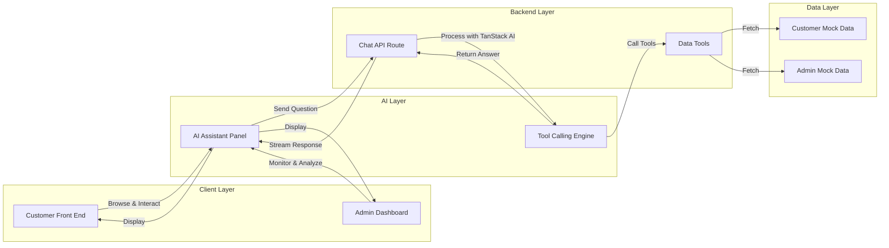
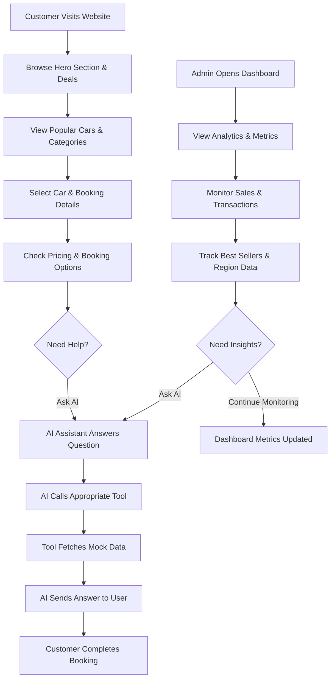
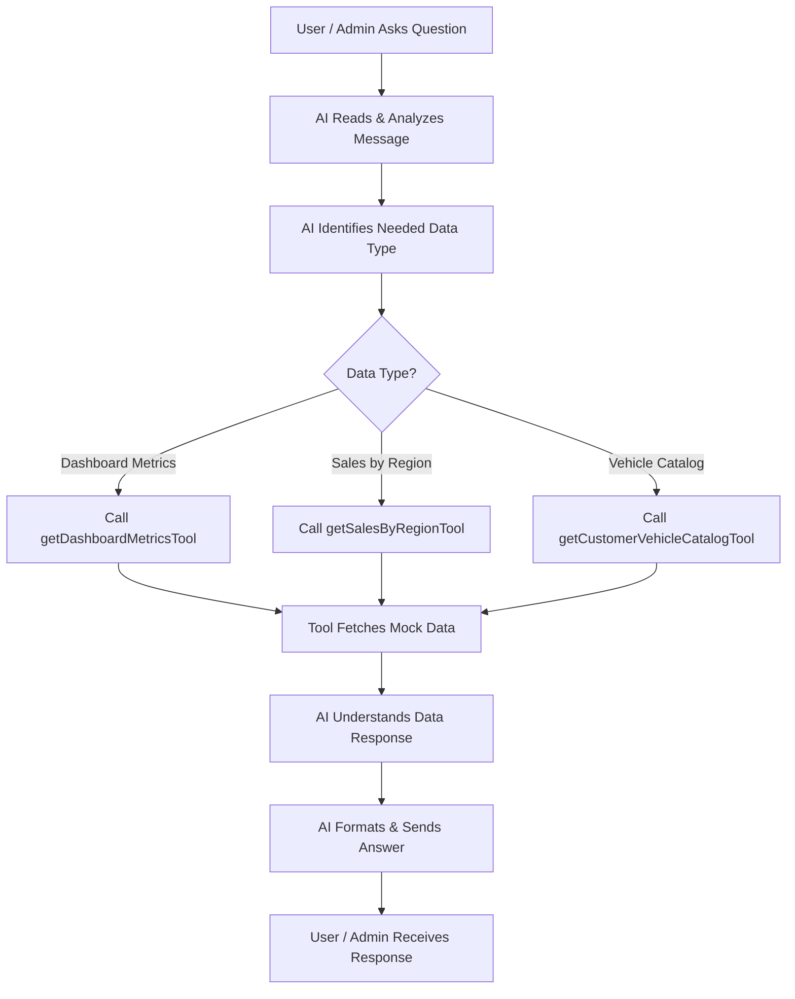

# BestCar

<p align="center">
  
</p>

A modern car rental website built with Next.js, designed to showcase a premium rental experience for both customers and administrators. This project includes a functional customer-facing storefront, a complete admin dashboard, and an AI-powered assistant that answers questions using website and company mock data.

## Live Project

- Customer Website: https://car-rental-nine-nu-98.vercel.app/
- Admin Dashboard: https://car-rental-nine-nu-98.vercel.app/admin
- GitHub Repository: https://github.com/Nafiziqbal-Perdita/car_rental

---

## Overview

This is a Car Rental Website built for a premium rental business experience. It combines:

- Customer-facing car booking and rental browsing
- Admin dashboard analytics and management
- AI assistant support using TanStack AI
- Mock data to simulate a real rental business workflow

The project follows a clean structure and a real-world app flow where the customer can browse cars, choose categories, view pricing, and explore rental deals; the admin can monitor sales, transactions, and performance; and the AI assistant can provide instant answers from the mock business data.

**System Architecture:**



---

## Website Workflow Structure

The full workflow of the project is designed in a simple and clear flow:



**Workflow Steps:**

1. **Customer Journey:**
   - Opens website and views hero section, deals, and featured cars
   - Browses vehicle categories and filters by preference
   - Selects a car and enters booking details
   - Reviews pricing and booking options
   - Can ask the AI assistant for rental help
   - Completes the rental booking

2. **Admin Dashboard:**
   - Opens admin panel to view business analytics
   - Monitors sales metrics, transactions, and performance
   - Tracks best-selling vehicles and regional sales
   - Can ask the AI assistant for business insights
   - Views updated dashboard metrics in real-time

3. **AI Assistant (Both Sides):**
   - Available to both customer and admin
   - Understands questions and calls the right tool
   - Retrieves data from mock datasets
   - Provides instant, accurate answers

---

## Functional Customer Front End


Customer Website URL: https://car-rental-nine-nu-98.vercel.app/

This is a functional customer website front end where customers can:

- browse popular car rental deals
- choose car categories and filter by type
- view pricing and vehicle details
- check rental booking information
- explore customer reviews and support sections
- use the AI assistant for instant information

The UI follows the Figma-driven design closely, and the design direction was guided by AI for faster implementation. The core technical decisions, structure, and logic were built by the developer, with AI used as a coding accelerator rather than the main decision-maker.

---

## Functional Admin Dashboard


Admin URL: https://car-rental-nine-nu-98.vercel.app/admin

This is a functional admin dashboard where the admin can analyze and monitor:

- Weekly earnings
- Best seller cars
- Recent transactions
- Sales analytics
- Sales by countries
- Inventory-related metrics and business performance data

This dashboard is designed to match the exact Figma layout and style, with a strong emphasis on a clean and professional business dashboard experience.

---

## AI Feature Demonstrations


The AI feature is available for both the customer and admin experience. The assistant can answer questions related to:

- available cars
- rental pricing
- car categories
- business data
- sales performance
- admin reporting information
- customer-side questions about car selection and booking

The AI is designed to answer faster and more efficiently than a normal manual lookup, and it works using the website's mock business data.

---

## AI Automation Workflow


The AI automation workflow is as follows:



**Workflow Steps:**

1. **User/Admin Question** — Customer or admin asks a question via the AI chat panel
2. **Message Analysis** — AI reads and understands the user's intent
3. **Data Identification** — AI determines which data source is needed
4. **Tool Selection** — Based on the question type, AI selects the appropriate tool:
   - `getDashboardMetricsTool` — for dashboard data (earnings, transactions)
   - `getSalesByRegionTool` — for sales and region performance
   - `getCustomerVehicleCatalogTool` — for vehicle inventory and pricing
5. **Data Fetch** — The selected tool retrieves data from the mock dataset
6. **Data Processing** — AI interprets the retrieved data
7. **Response Generation** — AI formats a helpful answer
8. **User Response** — Answer is sent back to the user in real-time

This is built using TanStack AI, which is highly effective for tool-calling workflows and real-time assistant behavior.

---

## Mock Data

Mock data is used throughout the project to make the website feel functional and realistic.

The mock dataset includes:

- car listings
- booking options
- customer reviews
- sales and income numbers
- transaction records
- best seller data
- sales-by-country statistics
- admin metrics and dashboard values

The mock data is intentionally created to simulate a real rental business environment while keeping the project lightweight and easy to run locally.

---

## Tech Stack

- Next.js
- React
- JavaScript
- Tailwind CSS
- TanStack AI
- Mock Data Layer

---

## Project Structure

```bash
src/
├── app/
│   ├── admin/
│   ├── api/
│   ├── customerFrontEnd/
│   ├── globals.css
│   ├── layout.js
│   └── page.js
├── components/
│   ├── BookingBar.jsx
│   ├── BookingField.jsx
│   ├── dashboard/
│   ├── Icon.jsx
│   └── WaveIcon.jsx
├── context/
│   └── DashboardContext.jsx
├── data/
│   ├── customerMockData.js
│   └── mockData.js
└── features/
    └── aiAssistant/
```

---

## Developer Notes

The project is built with a clear developer workflow:

- the tech stack was selected intentionally
- the logic was developed by the developer
- AI was used to speed up implementation and UI building
- the structure, architecture, and product decisions were controlled by the developer
- the final output is a functional product inspired by the Figma design and business concept

This project represents a strong blend of product thinking, UI implementation, data modeling, and AI-powered assistance.

---

## Run Locally

```bash
npm install
npm run dev
```

Or using Bun:

```bash
bun install
bun run dev
```

---

## Useful Commands

```bash
bun run lint
bun run build
```

---

## Summary

BestCar is a modern car rental website with a premium front-end, a functional admin dashboard, and an AI-powered assistant that answers based on website and company data. It demonstrates a real-world product flow from customer browsing to business analytics, all powered by a clean Next.js architecture with interactive mock data.

BestCar combines design, functionality, business logic, and AI automation into one complete rental website experience.

